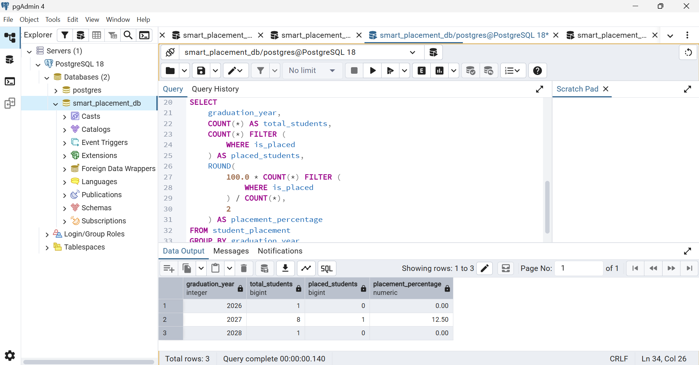
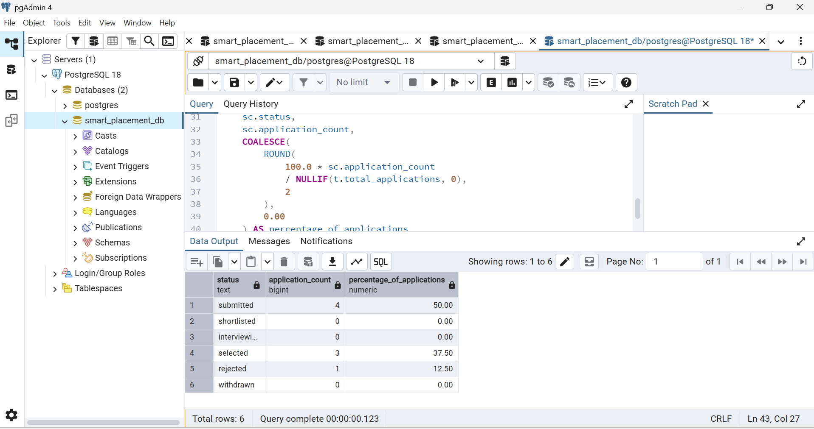
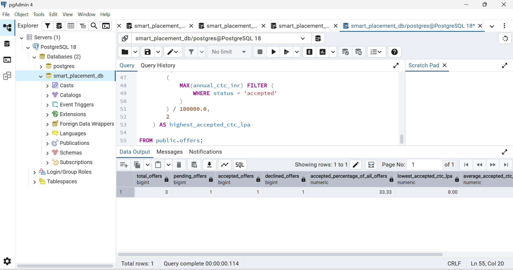

# Smart Placement Management System

A PostgreSQL project that models campus recruitment from student eligibility
and application submission through interviews, selection, offers, and placement
reporting.

The project focuses on relational database design, SQL reporting, PL/pgSQL
workflow functions, integrity constraints, transaction-based testing, and
measured query optimization.

## Project Overview

Placement management involves more than storing student and company records.
The system must determine eligibility, prevent duplicate applications, track
recruitment outcomes, and calculate placement statistics accurately.

This project implements those operations in PostgreSQL using fictional
demonstration data.

**Technology:** PostgreSQL 18, SQL, PL/pgSQL, pgAdmin 4, Git, and GitHub.

## Main Features

- Nine related tables covering students, companies, jobs, skills,
  applications, interviews, and offers.
- Eligibility checks for CGPA, graduation year, active backlogs,
  required skills, and open job status.
- Duplicate student-job application prevention.
- Controlled application-status transitions through database functions.
- Interview scheduling and result recording.
- Selection checks requiring at least one interview and all recorded
  rounds to be passed.
- Offer creation for selected applications.
- Offer acceptance and decline handling with timestamp validation.
- Placement reports that count each placed student once.
- A separate 100,000-row benchmark demonstrating a job lookup index.

## Database Design

| Table | Purpose |
|---|---|
| `companies` | Recruiting company details |
| `students` | Student profiles and academic information |
| `skills` | Shared skill catalog |
| `jobs` | Job openings and eligibility requirements |
| `student_skills` | Student-skill associations |
| `job_required_skills` | Required skills for each job |
| `applications` | Student applications and current statuses |
| `interviews` | Interview rounds, schedules, results, and feedback |
| `offers` | Annual CTC, offer status, and response timestamps |

The schema uses primary keys, foreign keys, unique constraints, check
constraints, and required fields.

Composite keys prevent duplicate skill mappings. Additional unique constraints
prevent duplicate applications, repeated round numbers within an application,
and multiple offers for the same application.

- [ER diagram](docs/er-diagram.md)
- [Requirements and business rules](docs/requirements.md)
- [Schema SQL](sql/01_schema.sql)

## Recruitment Workflow

A successful application progresses through:

1. Eligibility checking and application submission.
2. Shortlisting.
3. Interview scheduling and result recording.
4. Selection after the interview requirements are satisfied.
5. Offer creation.
6. Offer acceptance or decline.

Applications may also be rejected or withdrawn according to the allowed
status transitions.

### Database Functions

| Function | Responsibility |
|---|---|
| `submit_application` | Submit an eligible student-job pair |
| `change_application_status` | Validate and update application status |
| `schedule_interview` | Schedule a round for an interviewing application |
| `record_interview_result` | Record an outcome for a pending round |
| `create_offer` | Create a pending offer for a selected application |
| `respond_to_offer` | Accept or decline a pending offer |

The functions use validation and transactions, with row locking in the
status, interview, and offer operations.

Function-level workflow checks apply when these functions are called.
Direct table writes can bypass those additional checks; table constraints
continue to apply.

[View function definitions](sql/04_functions.sql)

## Eligibility and Placement Rules

A student qualifies for a job when:

- Their CGPA meets the minimum.
- Their graduation year matches.
- They have no active backlogs, unless the job allows them.
- They have every required skill.
- The job is open.

A job with no required skills passes the skills condition.

**Selected is not the same as placed.** A student is placed only when they
have at least one accepted offer.

Placement percentage is:

```text
Placed students in a graduation year
------------------------------------ × 100
All students in that graduation year
```

Students without applications remain in the denominator. Multiple accepted
offers do not cause a student to be counted more than once.

## Demonstration Dataset

The completed sample workflow contains:

| Record type | Count |
|---|---:|
| Companies | 5 |
| Students | 10 |
| Skills | 8 |
| Jobs | 6 |
| Student-skill mappings | 30 |
| Job-required-skill mappings | 13 |
| Applications | 8 |
| Interviews | 4 |
| Offers | 3 |

The sample outcomes include:

| Student | Outcome |
|---|---|
| Aarav Sharma | Selected; accepted an 8 LPA offer |
| Ananya Das | Selected; 9 LPA offer remains pending |
| Meera Rao | Selected; declined a 10 LPA offer |
| Priya Sen | Failed an interview; application rejected |

Internship-role sample offers represent full-time conversion packages,
not internship stipends.

Only Aarav counts as placed. The 2027 batch therefore has a placement
percentage of **12.50%: one placed student out of eight**.

## Reports

| Query | Output |
|---|---|
| [Eligible students](queries/01_eligible_students.sql) | Current eligible student-job pairs |
| [Application list](queries/02_application_list.sql) | Applications with student and job details |
| [Interview list](queries/03_interview_list.sql) | Interview schedules and results |
| [Offer list](queries/04_offer_list.sql) | Packages, outcomes, and timestamps |
| [Placed students](queries/05_placed_students.sql) | Each placed student listed once |
| [Placement by year](queries/06_placement_percentage_by_year.sql) | Cohort totals and placement percentages |
| [Company summary](queries/07_company_recruitment_summary.sql) | Jobs, applications, offers, and placements by company |
| [Application status summary](queries/08_application_status_summary.sql) | Current status distribution, including zero-count statuses |
| [Offer outcome summary](queries/09_offer_outcome_summary.sql) | Offer outcomes and accepted-package statistics |

Application-status reporting is a current-state snapshot, not a historical
conversion funnel. Accepted-package statistics are calculated per accepted
offer, not per distinct student.

## Query Performance

A separate `performance_lab` schema contains 100,000 synthetic applications
distributed across 1,000 jobs.

A lookup returning 100 applications was measured before and after adding
a B-tree index on `job_id`.

| Measurement | Before index | After index |
|---|---:|---:|
| Plan | Sequential scan | Bitmap index and heap scan |
| Returned rows | 100 | 100 |
| Shared buffer hits | 935 | 102 |
| Execution time | 5.215 ms | 0.248 ms |

The captured executions show approximately **95.2% lower execution time**
for this specific lookup.

These are individual local benchmark measurements, not averages or a
guarantee of production performance. The index also adds storage and
write-maintenance costs.

[Benchmark method, scripts, evidence, and limitations](docs/performance-analysis.md)

## Running the Project

### Prerequisites

- PostgreSQL 18, used during development.
- pgAdmin 4.
- A local copy of this repository.

### Setup

Create a fresh database, open its Query Tool, and execute these files once
in order:

1. `sql/01_schema.sql`
2. `sql/02_sample_data.sql`
3. `sql/03_views.sql`
4. `sql/04_functions.sql`
5. `sql/05_sample_applications.sql`
6. `sql/06_sample_workflow.sql`
7. `sql/07_additional_sample_outcomes.sql`
8. `sql/08_indexes.sql`

These are fresh-install scripts, not repeatable migrations. Stop and
investigate if a script fails; some files contain multiple committed batches.

The `performance` scripts are optional and are not part of the normal
demonstration build.

[Detailed setup instructions and expected results](docs/setup-guide.md)

## Validation

The project includes stepwise SQL checks for:

- Valid inserts and transaction rollback.
- Invalid CGPA, duplicate email, and foreign-key rejection.
- Expected eligibility results.
- Valid, ineligible, and duplicate application submissions.
- Allowed and forbidden application-status transitions.
- Interview scheduling restrictions and result-overwrite rejection.
- Selection rejection when an interview is pending.
- Offer creation restrictions.
- Offer acceptance, invalid response dates, and repeated-response rejection.
- Placement counting when a student has multiple accepted offers.

Tests have specific starting-state requirements and are executed in sections.
They are not a single automated test suite to run against the completed
demonstration dataset.

A fresh-database rebuild was also completed, with final record counts and
workflow outcomes checked.

- [Test scripts](tests/)
- [Test execution guidance](docs/setup-guide.md#5-test-execution)
- [Rebuild evidence](screenshots/58_fresh_database_rebuild.png)

## Repository Organization

| Location | Contents |
|---|---|
| `sql/` | Schema, sample data, view, functions, index, and inspection scripts |
| `queries/` | Read-only reporting queries |
| `tests/` | Stepwise validation and rejection tests |
| `performance/` | Isolated benchmark setup and execution-plan queries |
| `docs/` | Requirements, ER diagram, setup guide, and performance analysis |
| `screenshots/` | Workflow, test, reporting, and benchmark evidence |

## Selected Screenshots

### Placement Percentage by Graduation Year



### Application Status Distribution



### Offer Outcomes



### Indexed Lookup Plan


## Scope and Limitations

- Database-focused project; no frontend or backend API.
- No application-role permission setup forcing writes through the functions.
- No application-status history or comprehensive audit log.
- Concurrent eligibility-input changes are not comprehensively coordinated
  by the submission function.
- Sample events use fixed fictional dates. Cross-table timestamp chronology
  and current-clock checks are not fully enforced.
- Reopening terminal applications and correcting completed results or
  responses are outside the current workflow.
- Sample name-based lookups rely on the controlled dataset.
- Tests require the documented intermediate states.

See the [setup guide](docs/setup-guide.md#7-scope-and-known-limitations)
for details.

## Author

**Subhadip Pradhan**

[GitHub](https://github.com/subhadipp123)