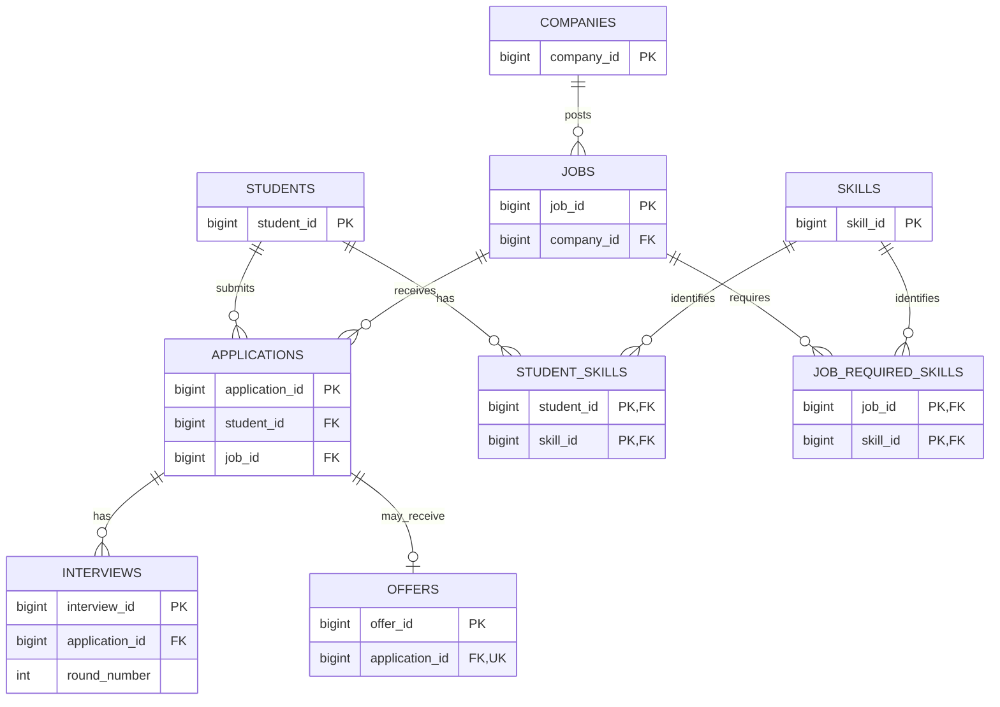

# Smart Placement Management System — ER Diagram

## Relationship rules

- One company can post zero or many jobs. Each job belongs to exactly one company.
- One student can submit zero or many applications. Each application belongs to exactly one student.
- One job can receive zero or many applications. Each application belongs to exactly one job.
- A student can have many skills, and a skill can be held by many students.
- A job can require many skills, and a skill can be required by many jobs.
- A student cannot apply to the same job twice.
- Each student-skill pair and job-skill pair must be unique.
- An application can have zero or many interview rounds. Each round belongs to one application.
- Round numbers cannot repeat within the same application.
- An application can have zero or one offer. Each offer belongs to one application.

## Definitions used by the system

### Eligible to apply
A student is eligible to apply for a job when all of these are true:
- The student's CGPA is greater than or equal to the job's minimum CGPA.
- The student's graduation year matches the job's required graduation year.
- The student has no active backlogs, unless the job allows active backlogs.
- The student has every skill marked as required for the job.
- The job is open for applications.

A job with no required skills does not reject a student because of skills.

### Application
- An application links exactly one student to exactly one job.
- A student can have at most one application for a particular job.
- Interview rounds are numbered separately for each application. For example,
  two different applications can both have a "round 1".
- An application may have no interviews and may have at most one offer.

### Offer and placement
- An offer can be pending, accepted, or declined.
- "Received an offer" means the student has an offer record, regardless of status.
- "Placed" means the student has accepted at least one offer.
- A student who accepts two offers is counted only once in the number of
  placed students.
- Placement percentage for a graduating year is:
  (number of placed students in that year / total students in that year) * 100.