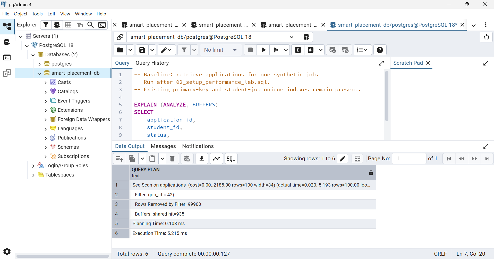
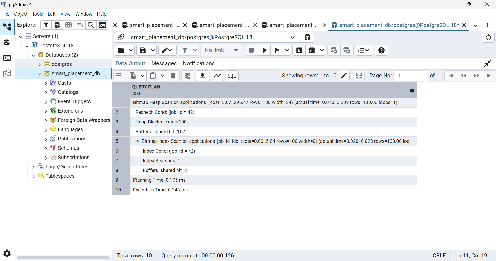

# Performance Analysis

## Objective

Measure the effect of a dedicated `job_id` index when retrieving applications for one job.

## Environment and Dataset

- PostgreSQL 18 on a local Windows machine.
- Queries executed through pgAdmin using `EXPLAIN (ANALYZE, BUFFERS)`.
- Isolated benchmark table: `performance_lab.applications`.
- 100,000 synthetic applications.
- 100,000 distinct synthetic student IDs.
- 1,000 synthetic job IDs, with 100 applications per job.
- Baseline indexes: an application primary-key index and a unique index on `(student_id, job_id)`.
- No foreign-key constraints in the benchmark table.
- `ANALYZE` was run after loading the dataset.

The benchmark measures application lookup performance. It does not simulate the complete placement workflow or concurrent users.

## Benchmark Query

The same query was used before and after creating the index:

```sql
EXPLAIN (ANALYZE, BUFFERS)
SELECT
    application_id,
    student_id,
    status,
    applied_at
FROM performance_lab.applications
WHERE job_id = 42;
```

The query returns 100 rows, representing 0.1% of the benchmark table.

## Added Benchmark Index

```sql
CREATE INDEX applications_job_id_idx
ON performance_lab.applications (job_id);
```

This creates a B-tree index on `job_id` in the benchmark table.

The existing unique index starts with `(student_id, job_id)`. The additional index provides an access path starting directly with the column used by this lookup.

## Observed Results

| Measurement | Before Index | After Index |
|---|---:|---:|
| Scan method | Sequential scan | Bitmap index and heap scan |
| Returned rows | 100 | 100 |
| Rows removed by filter | 99,900 | Not reported |
| Shared buffer hits at the top-level node | 935 | 102 |
| Planning time | 0.103 ms | 0.175 ms |
| Execution time | 5.215 ms | 0.248 ms |

These values come from one captured execution plan per condition. They are not averages or medians.

### Execution-Time Comparison

```text
Execution-time reduction:
((5.215 - 0.248) / 5.215) × 100 ≈ 95.2%

Speedup:
5.215 / 0.248 ≈ 21.0×
```

For these captured runs, the indexed query had approximately **95.2% lower execution time**, equivalent to about a **21× speedup**.

These figures describe this specific synthetic lookup and are not production performance guarantees.

## Execution-Plan Interpretation

### Before the Index

PostgreSQL used a sequential scan:

- Scanned the application table.
- Returned 100 matching rows.
- Removed 99,900 rows through the filter.
- Reported 935 shared buffer hits.

### After the Index

PostgreSQL used:

1. A bitmap index scan on `applications_job_id_idx` to locate matching rows.
2. A bitmap heap scan to retrieve those rows from the table.

The plan reported:

- 100 returned rows.
- 100 exact heap blocks.
- 102 shared buffer hits at the top-level node.
- 2 shared buffer hits within the index-scan node.

The top-level buffer count includes child-node activity. The index scan's 2 hits must not be added to the top-level 102 again.

Both captured executions reported shared buffer hits without reported shared reads. The comparison therefore demonstrates reduced lookup work with cached data, rather than a measured reduction in physical disk reads.

## Correctness

Both plans returned 100 rows for the same query and dataset.

The query has no `ORDER BY`, so row order is unspecified and may change when the execution plan changes.

## Tradeoffs and Limitations

- The additional index consumes storage.
- Inserts and relevant updates require index maintenance.
- Index size and write overhead were not measured in this comparison.
- Results depend on data distribution, selectivity, cache state, hardware, and concurrent activity.
- Queries returning a large proportion of the table may favor a sequential scan.
- The benchmark uses uniformly distributed synthetic job IDs.
- The eight-row demonstration table is too small to establish a meaningful index speedup.
- The measured improvement applies to this lookup, not to every report or to the entire application.

## Benchmark Setup and Reproducibility

The original measured benchmark was created using
`LIKE public.applications INCLUDING ALL`, before the main table had
a dedicated `job_id` index. The setup script now defines the equivalent
baseline table structure explicitly, including its primary-key and
student-job unique indexes. This prevents future indexes on the main
table from being inherited by a fresh benchmark. The recorded timings
remain those from the original captured runs.

The benchmark table uses synthetic student and job IDs without foreign
keys. It is isolated from the project's demonstration records in the
`public` schema.

### Reproduction Steps

Use a database without an existing `performance_lab` schema.

1. Run `performance/02_setup_performance_lab.sql` once.
2. Confirm 100,000 applications, 1,000 distinct jobs, and 100 applications for job 42.
3. Run `performance/03_job_lookup_before_index.sql` three times.
4. Preserve the baseline plans and execution times.
5. Run `performance/04_add_job_lookup_index.sql` once.
6. Run `performance/05_job_lookup_after_index.sql` three times.
7. Compare returned row counts, scan methods, buffers, and execution times.

After the benchmark index exists, rerunning the before-index query file
does not recreate the original baseline. PostgreSQL plans queries using
the indexes currently available.

The results table above records only the two captured screenshots;
other run timings were not included.

## Main Project Index

The corresponding main-table index is defined in `sql/08_indexes.sql`:

```sql
CREATE INDEX applications_job_id_idx
ON public.applications (job_id);
```

The main-table index and benchmark index belong to different schemas.

This additional index supports job-based application lookups. It does
not replace the unique `(student_id, job_id)` index, which enforces
one application per student-job pair.

PostgreSQL may still choose a sequential scan for the small demonstration
table. The benchmark speedup should not be attributed to that table
without a separate measurement.

## Evidence

### Before Index



### After Index

