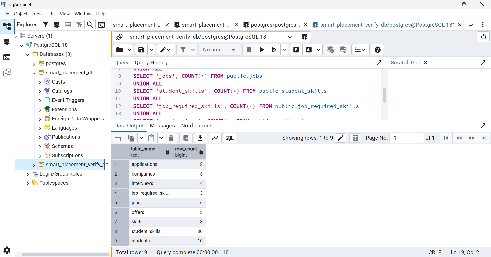

# Setup Guide

## Requirements

- PostgreSQL 18, the version used during development.
- pgAdmin 4 for running SQL scripts.
- A local copy of this repository.

All demonstration data is fictional.

## 1. Create a Fresh Database

Open pgAdmin and connect to your PostgreSQL server.

Open the Query Tool for the existing `postgres` database and run:

```sql
CREATE DATABASE smart_placement_db;
```

Run this command by itself, outside a transaction.

If that name already exists, use a new database name, for example:

```sql
CREATE DATABASE smart_placement_verify_db;
```

Refresh the Databases node, then open a new Query Tool specifically
for the newly created database.

Confirm the connection:

```sql
SELECT current_database();
```

Selecting a database in the sidebar does not switch an existing
Query Tool connection.

## 2. Execute the Build Scripts

Run each complete file once, in this order:

| Order | File | Purpose |
|---:|---|---|
| 1 | `sql/01_schema.sql` | Create nine tables and their constraints |
| 2 | `sql/02_sample_data.sql` | Load companies, students, skills, jobs, and skill mappings |
| 3 | `sql/03_views.sql` | Create the eligibility view |
| 4 | `sql/04_functions.sql` | Create six workflow functions |
| 5 | `sql/05_sample_applications.sql` | Submit eight sample applications |
| 6 | `sql/06_sample_workflow.sql` | Complete Aarav's workflow through offer acceptance |
| 7 | `sql/07_additional_sample_outcomes.sql` | Add pending, declined, and rejected outcomes |
| 8 | `sql/08_indexes.sql` | Create the additional job lookup index |

For each file:

1. Open the file in your editor.
2. Copy its entire contents into the verification database's Query Tool.
3. Ensure no partial text selection remains.
4. Execute the script.
5. Check for errors before proceeding.

These are fresh-install scripts. They are not intended to be rerun
against an already populated database.

Some files contain multiple transaction blocks. If an error occurs,
stop, record the original error, and run `ROLLBACK;` in the same session
to clear any failed transaction. Earlier committed blocks may remain,
so investigate the database state before retrying.

Do not run the `tests` or `performance` folders as part of the normal
demonstration build.

## 3. Verify the Final Dataset

Run:

```sql
SELECT 'companies' AS table_name, COUNT(*) AS row_count
FROM public.companies
UNION ALL
SELECT 'students', COUNT(*) FROM public.students
UNION ALL
SELECT 'skills', COUNT(*) FROM public.skills
UNION ALL
SELECT 'jobs', COUNT(*) FROM public.jobs
UNION ALL
SELECT 'student_skills', COUNT(*) FROM public.student_skills
UNION ALL
SELECT 'job_required_skills', COUNT(*) FROM public.job_required_skills
UNION ALL
SELECT 'applications', COUNT(*) FROM public.applications
UNION ALL
SELECT 'interviews', COUNT(*) FROM public.interviews
UNION ALL
SELECT 'offers', COUNT(*) FROM public.offers
ORDER BY table_name;
```

Expected:

| Table | Rows |
|---|---:|
| applications | 8 |
| companies | 5 |
| interviews | 4 |
| job_required_skills | 13 |
| jobs | 6 |
| offers | 3 |
| skills | 8 |
| student_skills | 30 |
| students | 10 |

Check application statuses:

```sql
SELECT status, COUNT(*) AS application_count
FROM public.applications
GROUP BY status
ORDER BY status;
```

Expected:

| Status | Count |
|---|---:|
| rejected | 1 |
| selected | 3 |
| submitted | 4 |

Check interview results:

```sql
SELECT result, COUNT(*) AS interview_count
FROM public.interviews
GROUP BY result
ORDER BY result;
```

Expected:

| Result | Count |
|---|---:|
| failed | 1 |
| passed | 3 |

Check offer statuses:

```sql
SELECT status, COUNT(*) AS offer_count
FROM public.offers
GROUP BY status
ORDER BY status;
```

Expected:

| Status | Count |
|---|---:|
| accepted | 1 |
| declined | 1 |
| pending | 1 |

Check eligibility:

```sql
SELECT COUNT(*) AS eligible_pairs
FROM public.eligible_student_jobs;
```

Expected: **17**.

Eligibility describes current qualifications. The view does not exclude
pairs that already have an application; the unique application constraint
prevents duplicate submissions.

## 4. Run the Reports

The files in `queries` are read-only reports:

| File | Purpose |
|---|---|
| `01_eligible_students.sql` | Eligible student-job pairs |
| `02_application_list.sql` | Applications with student and job details |
| `03_interview_list.sql` | Interview rounds and results |
| `04_offer_list.sql` | Offer packages, statuses, and timestamps |
| `05_placed_students.sql` | Each placed student listed once |
| `06_placement_percentage_by_year.sql` | Placement percentage by graduation year |
| `07_company_recruitment_summary.sql` | Company-level recruitment totals |
| `08_application_status_summary.sql` | Current application-status distribution |
| `09_offer_outcome_summary.sql` | Offer outcomes and accepted-package statistics |

After the full build:

- Aarav is the only placed student.
- The 2027 batch has 8 students and 1 placed student: **12.50%**.
- The 2026 and 2028 batches have **0.00%** placement.
- There are 3 offers: 1 accepted, 1 pending, and 1 declined.
- Accepted-offer package statistics are **8.00 LPA**.

## 5. Test Execution

The files in `tests` are stepwise SQL checks created during development.
They are not a single automated test suite.

Read each test's starting-state requirements before execution.
Some require:

- Empty application tables.
- Applications still marked `submitted`.
- A pending interview.
- A pending offer.

The final sample dataset no longer satisfies all those initial conditions.

Use a separate test database and prepare the state required by each test.
Do not reset the demonstration data merely to run an earlier test.

For tests containing an expected error:

1. Run the documented sections separately in the same Query Tool tab.
2. Verify the specific error message and SQLSTATE.
3. Run `ROLLBACK;` after the error.
4. Verify the expected restored state.

An unexpected error is not a passing test.

Identity sequences can advance during rolled-back tests. Generated IDs
therefore need not be consecutive or match screenshots.

## 6. Performance Benchmark

The optional benchmark uses the separate `performance_lab` schema.

Follow [Performance Analysis](performance-analysis.md) for setup,
measurement order, results, and limitations.

The benchmark contains 100,000 synthetic applications. It does not
populate the demonstration tables with those records.

## 7. Scope and Known Limitations

- This project is a PostgreSQL database implementation, without a frontend
  or backend API.
- Workflow functions enforce additional business rules when called.
  Direct table writes can bypass function-level checks.
- Application role permissions have not been configured to force all
  writes through the functions.
- Application status history is not stored. The status report is a
  current-state snapshot, not a historical conversion funnel.
- Application eligibility is evaluated when the submission statement
  runs; concurrent changes to eligibility inputs are not comprehensively
  coordinated by that function.
- Sample workflows simulate events on fixed dates without checking the
  current clock.
- Cross-table timestamp chronology is not fully enforced. Application
  timestamps use their defaults, while sample interview and offer dates
  are fixed; a later rebuild can therefore produce application timestamps
  after those fictional event dates.
- Offer responses cannot precede their offer timestamps.
- Internship-role sample offers represent full-time conversion packages,
  not internship stipends.
- Company names and company-job-title combinations are not guaranteed
  unique by the schema. Sample lookups rely on the controlled dataset.
- Reopening terminal applications and correcting completed interview
  results or offer responses are outside the current workflow.

## Rebuild Evidence

The eight main build scripts were run in a separate verification database,
and the final table counts and workflow outcomes were checked.

